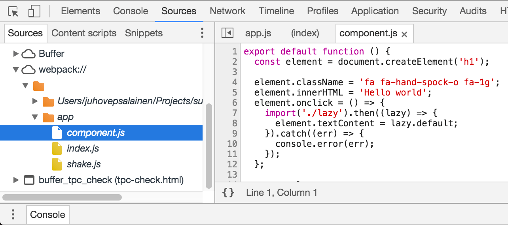

# Source Maps



当你的源代码经过了转换时，调试就成了问题。 在浏览器中调试时，如何判断原始代码在哪里？ **source maps**通过提供原始代码和转换后的源代码之间的映射来解决此问题。 除了源代码编译JavaScript之外，这也适用于样式。

一种常用的方案是在开发期间跳过源映射，并依赖于浏览器对语言功能的支持。如果你使用没有任何扩展的ES2015，并使用现代浏览器进行开发。这样做的好处是可以避免与源映射相关的所有问题，同时获得更好的性能。

如果你使用webpack4.x和新的 `mode` 选项，那么，它将在`development`模式下自动为你生成源映射。 但是，生产使用需要注意。

> 如果你想更详细地了解源映射背后的想法，阅读Ryan Seddon对该[主题]（https://www.html5rocks.com/en/tutorials/developertools/sourcemaps/）的介绍。

> 要查看webpack如何处理源映射，请参阅该工具的作者的[source-map-visualization]（https://sokra.github.io/source-map-visualization/）。

## 内联 Source-Maps 和 分离 Source-Maps

Webpack可以生成内联或单独的源映射文件。由于更好的性能，内置的在生产过程中是有价值的，而单独的那些在生产中使用非常方便，因为它可以保持输出文件尺寸小。在这种情况下，加载源映射是可选的。

你可能不希望为生产包生成源映射，因为这样可以轻松检查你的应用程序。 通过禁用源映射，你可以实现一定程度的干扰。 无论你是否要为生产启用源映射，它们都可以方便地进行分段。 跳过源映射会加快构建速度，因为生成最佳质量的源映射可能是一项复杂的操作。

**隐藏的源映射**提供堆栈跟踪信息。你可以将它们与监视服务连接，以便在应用程序崩溃时获取跟踪，从而允许你修复有问题的情况。虽然这不是理想的，但还是可以了解可能出现的问题。

> 研究你正在使用的loader的文档以查看loader特定提示是个好主意。 例如，使用TypeScript，你必须设置特定标志以使其按预期工作。

## 启用 Source-Maps

Webpack提供了两种启用源映射的方法。有一个 `devtool` 字段的快捷方式。你还可以找到两个插件，提供更多调整选项。插件将在本章末尾简要讨论。除了webpack之外，你还必须在用于开发的浏览器上启用对源映射的支持。

### 在Webpack中启用 Source-Maps 

首先，你可以将核心思想包含在配置中。如果需要，你稍后可以将其转换为插件使用：

**webpack.parts.js**

```javascript
exports.generateSourceMaps = ({ type }) => ({
  devtool: type,
});
```

Webpack支持各种源映射类型。这些因质量和构建速度而异。现在，你可以在生产中启用 `source-map` ，让webpack使用默认开发。配置如下：

**webpack.config.js**

```javascript
const productionConfig = merge([
  parts.generateSourceMaps({ type: "source-map" }),
  ...
]);
```

`source-map` 是所有这些中最慢和最高质量的选择，但这对于生产构建来说很好。

运行 `npm run build` 脚本命令，你将会在输出中看到source-map：

```bash
Hash: b59445cb2b9ae4cea11b
Version: webpack 4.1.1
Time: 1347ms
Built at: 3/16/2018 4:58:14 PM
       Asset       Size  Chunks             Chunk Names
     main.js  838 bytes       0  [emitted]  main
    main.css   3.49 KiB       0  [emitted]  main
 main.js.map   3.75 KiB       0  [emitted]  main
main.css.map   85 bytes       0  [emitted]  main
  index.html  220 bytes          [emitted]
Entrypoint main = main.js main.css main.js.map main.css.map
...
```

仔细看看那些* .map *文件。 这就是生成和源之间的映射发生的地方。 在开发期间，它将映射信息写入构建生成的包中。

### 在浏览器中启用Source-Maps

要在浏览器中使用源映射，必须根据不同的浏览器的说明文档启用源映射：

* [Chrome](https://developer.chrome.com/devtools/docs/javascript-debugging)。 有时源映射不会在[Chrome检查器]（https://github.com/webpack/webpack/issues/2478）中更新。 目前，临时修复是强制检查员使用 `alt + r` 快捷键重新加载自身。
* [Firefox](https://developer.mozilla.org/en-US/docs/Tools/Debugger/How_to/Use_a_source_map)
* [IE Edge](https://developer.microsoft.com/en-us/microsoft-edge/platform/documentation/f12-devtools-guide/debugger/#source-maps)
* [Safari](https://support.apple.com/guide/safari/use-the-safari-develop-menu-sfri20948/mac)

> 如果你想要使用断点 (如：`debugger;`), 基于 `eval` 的选项在Chrome中不起作用！

## Webpack支持的Source-Map类型

webpack支持的源映射类型可以分为两类：

* **内联** 源映射将映射数据直接添加到生成的文件中。
* **分离** 源映射将映射数据发送到单独的源映射文件，并使用注释将源链接到它们。隐藏的源映射会故意省略注释。

由于速度快，内联源映射是开发的理想选择。鉴于它们使构建生成的包很大，分离的源映射是生产的首选解决方案。如果性能开销可以接受，则在开发期间分离的源映射也可以工作。

## 内联的Source-Map类型

Webpack提供多个内联源映射变体。通常`eval`是起点，[webpack问题＃2145]（https://github.com/webpack/webpack/issues/2145#issuecomment-294361203）推荐`cheap-module-eval-source-map`，因为它是在Chrome和Firefox浏览器中可靠地工作时，速度和质量之间的良好折衷。

为了更好地了解可用选项，下面列出了它们，同时为每个选项提供了一个小例子。 源代码只包含一个`console.log（'Hello world'）`和`webpack.NamedModulesPlugin`用于保持输出更容易理解。你会发现，需要更多代码来处理映射。

### `devtool: "eval"`

查看`eval`生成代码，其中每个模块都包含在`eval`函数中：

```javascript
webpackJsonp([1, 2], {
  "./src/index.js": function(module, exports) {
    eval("console.log('Hello world');\n\n//////////////////\n// WEBPACK FOOTER\n// ./src/index.js\n// module id = ./src/index.js\n// module chunks = 1\n\n//# sourceURL=webpack:///./src/index.js?")
  }
}, ["./src/index.js"]);
```

### `devtool: "cheap-eval-source-map"`

`cheap-eval-source-map`更进一步，它将包含base64编码版本的代码作为数据网址。结果仅包含行数据而丢失列映射。

```javascript
webpackJsonp([1, 2], {
  "./src/index.js": function(module, exports) {
    eval("console.log('Hello world');//# sourceMappingURL=data:application/json;charset=utf-8;base64,eyJ2ZXJzaW9uIjozLCJmaWxlIjoiLi9hcHAvaW5kZXguanMuanMiLCJzb3VyY2VzIjpbIndlYnBhY2s6Ly8vLi9hcHAvaW5kZXguanM/MGUwNCJdLCJzb3VyY2VzQ29udGVudCI6WyJjb25zb2xlLmxvZygnSGVsbG8gd29ybGQnKTtcblxuXG4vLy8vLy8vLy8vLy8vLy8vLy9cbi8vIFdFQlBBQ0sgRk9PVEVSXG4vLyAuL2FwcC9pbmRleC5qc1xuLy8gbW9kdWxlIGlkID0gLi9hcHAvaW5kZXguanNcbi8vIG1vZHVsZSBjaHVua3MgPSAxIl0sIm1hcHBpbmdzIjoiQUFBQSIsInNvdXJjZVJvb3QiOiIifQ==")
  }
}, ["./src/index.js"]);
```

如果解码该base64字符串，则会获得包含映射的输出：

```json
{
  "file": "./src/index.js",
  "mappings": "AAAA",
  "sourceRoot": "",
  "sources": [
    "webpack:///./src/index.js?0e04"
  ],
  "sourcesContent": [
    "console.log('Hello world');\n\n\n//////////////////\n// WEBPACK FOOTER\n// ./src/index.js\n// module id = ./src/index.js\n// module chunks = 1"
  ],
  "version": 3
}
```

### `devtool: "cheap-module-eval-source-map"`

`cheap-module-eval-source-map` 核心思想相同，但它提供了更高的质量和更低的性能：

```javascript
webpackJsonp([1, 2], {
  "./src/index.js": function(module, exports) {
    eval("console.log('Hello world');//# sourceMappingURL=data:application/json;charset=utf-8;base64,eyJ2ZXJzaW9uIjozLCJmaWxlIjoiLi9hcHAvaW5kZXguanMuanMiLCJzb3VyY2VzIjpbIndlYnBhY2s6Ly8vYXBwL2luZGV4LmpzPzIwMTgiXSwic291cmNlc0NvbnRlbnQiOlsiY29uc29sZS5sb2coJ0hlbGxvIHdvcmxkJyk7XG5cblxuLy8gV0VCUEFDSyBGT09URVIgLy9cbi8vIGFwcC9pbmRleC5qcyJdLCJtYXBwaW5ncyI6IkFBQUEiLCJzb3VyY2VSb290IjoiIn0=")
  }
}, ["./src/index.js"]);
```

再次，解码数据结果显示如下：

```json
{
  "file": "./src/index.js",
  "mappings": "AAAA",
  "sourceRoot": "",
  "sources": [
    "webpack:///src/index.js?2018"
  ],
  "sourcesContent": [
    "console.log('Hello world');\n\n\n// WEBPACK FOOTER //\n// src/index.js"
  ],
  "version": 3
}
```

在这种特殊情况下，选项之间的差异很小。

### `devtool: "eval-source-map"`

`eval-source-map`是内联选项中最高质量的选项，但它也是最慢的，因为它输出的数据最多：

```javascript
webpackJsonp([1, 2], {
  "./src/index.js": function(module, exports) {
    eval("console.log('Hello world');//# sourceMappingURL=data:application/json;charset=utf-8;base64,eyJ2ZXJzaW9uIjozLCJzb3VyY2VzIjpbIndlYnBhY2s6Ly8vLi9hcHAvaW5kZXguanM/ZGFkYyJdLCJuYW1lcyI6WyJjb25zb2xlIiwibG9nIl0sIm1hcHBpbmdzIjoiQUFBQUEsUUFBUUMsR0FBUixDQUFZLGFBQVoiLCJmaWxlIjoiLi9hcHAvaW5kZXguanMuanMiLCJzb3VyY2VzQ29udGVudCI6WyJjb25zb2xlLmxvZygnSGVsbG8gd29ybGQnKTtcblxuXG4vLyBXRUJQQUNLIEZPT1RFUiAvL1xuLy8gLi9hcHAvaW5kZXguanMiXSwic291cmNlUm9vdCI6IiJ9")
  }
}, ["./src/index.js"]);
```

这次可以为浏览器提供更多的映射数据：

```json
{
  "file": "./src/index.js",
  "mappings": "AAAAA,QAAQC,GAAR,CAAY,aAAZ",
  "names": [
    "console",
    "log"
  ],
  "sourceRoot": "",
  "sources": [
    "webpack:///./src/index.js?dadc"
  ],
  "sourcesContent": [
    "console.log('Hello world');\n\n\n// WEBPACK FOOTER //\n// ./src/index.js"
  ],
  "version": 3
}
```

## 分离的 Source-Map 种类

Webpack还可以生成生产模式下使用友好的源映射。它们最终以分离的文件结束，以`.map`扩展名结尾，仅在需要时由浏览器加载。这样你的用户就可以获得良好的性能，同时你可以更轻松地调试应用程序。

`source-map`是一个合理的默认值。即使以这种方式生成源映射需要更长的时间，你也可以获得最佳质量。如果你不关心生产模式下的源映射，则可以跳过该设置并获得更好的性能。

### `devtool: "cheap-source-map"`

`cheap-source-map`类似于上面的 `cheap` 选项。结果将丢失列映射。此外，不会使用来自loader的源映射，例如* css-loader *。

在这种情况下，检查 `.map` 文件会显示以下输出：

```json
{
  "file": "main.9aff3b1eced1f089ef18.js",
  "mappings": "AAAA",
  "sourceRoot": "",
  "sources": [
    "webpack:///main.9aff3b1eced1f089ef18.js"
  ],
  "sourcesContent": [
    "webpackJsonp([1,2],{\"./src/index.js\":function(o,n){console.log(\"Hello world\")}},[\"./src/index.js\"]);\n\n\n// WEBPACK FOOTER //\n// main.9aff3b1eced1f089ef18.js"
  ],
  "version": 3
}
```

源代码在其末尾包含`//＃sourceMappingURL = main.9a ... 18.js.map`这种类型的注释，并将它映射到此文件。

### `devtool: "cheap-module-source-map"`

`cheap-module-source-map`与之前的相同，只是来自loader的源映射被简化为每行一个映射。 在这种情况下，它会产生以下输出：

```json
{
  "file": "main.9aff3b1eced1f089ef18.js",
  "mappings": "AAAA",
  "sourceRoot": "",
  "sources": [
    "webpack:///main.9aff3b1eced1f089ef18.js"
  ],
  "version": 3
}
```

> `cheap-module-source-map` 是目前解决 [代码压缩被启用引起的问题](https://github.com/webpack/webpack/issues/4176) ，这是避免这个问题出现的一个很好用的选项。

### `devtool: "hidden-source-map"`

`hidden-source-map`与`source-map`相同，只是它不会将对源映射的引用写入源文件 如果你不希望在希望使用正确的堆栈跟踪时直接将源映射公开给开发工具，这很方便。

### `devtool: "nosources-source-map"`

`nosources-source-map`创建一个没有`sourcesContent`的源映射。不过，你仍然可以获得堆栈跟踪。如果你不希望将源代码公开给客户端，则该选项很有用。

> [官方文档](https://webpack.js.org/configuration/devtool/#devtool) 包含更多关于`devtool`选项的信息。

### `devtool: "source-map"`

`source-map`提供最好的质量和完整的结果，但它也是编译最慢的选项配置。 输出反映了这一点：

```json
{
  "file": "main.9aff3b1eced1f089ef18.js",
  "mappings": "AAAAA,cAAc,EAAE,IAEVC,iBACA,SAAUC,EAAQC,GCHxBC,QAAQC,IAAI,kBDST",
  "names": [
    "webpackJsonp",
    "./src/index.js",
    "module",
    "exports",
    "console",
    "log"
  ],
  "sourceRoot": "",
  "sources": [
    "webpack:///main.9aff3b1eced1f089ef18.js",
    "webpack:///./src/index.js"
  ],
  "sourcesContent": [
    "webpackJsonp([1,2],{\n\n/***/ \"./src/index.js\":\n/***/ (function(module, exports) {\n\nconsole.log('Hello world');\n\n/***/ })\n\n},[\"./src/index.js\"]);\n\n\n// WEBPACK FOOTER //\n// main.9aff3b1eced1f089ef18.js",
    "console.log('Hello world');\n\n\n// WEBPACK FOOTER //\n// ./src/index.js"
  ],
  "version": 3
}
```

## 其他Source-Map选项

还有一些其他选项会影响源映射的生成：

```javascript
{
  output: {
    // Modify the name of the generated source map file.
    // You can use [file], [id], and [hash] replacements here.
    // The default option is enough for most use cases.
    sourceMapFilename: '[file].map', // Default

    // This is the source map filename template. It's default
    // format depends on the devtool option used. You don't
    // need to modify this often.
    devtoolModuleFilenameTemplate:
      'webpack:///[resource-path]?[loaders]'
  },
}
```

> [官方文档](https://webpack.js.org/configuration/output/#output-sourcemapfilename) 深入研究 `输出
` 细节。

> 如果你正在使用 `UglifyJsPlugin` 并且仍然需要源映射，则需要为插件启用 `sourceMap：true`。否则，结果不是你所期望的，因为UglifyJS将执行代码的进一步转换，从而打破映射。其他插件和loader执行更改时也必须这样做。 *css-loader*就是一个很好的例子。

## `SourceMapDevToolPlugin` 和 `EvalSourceMapDevToolPlugin`

If you want more control over source map generation, it's possible to use the [SourceMapDevToolPlugin](https://webpack.js.org/plugins/source-map-dev-tool-plugin/) or `EvalSourceMapDevToolPlugin` instead. The latter is a more limited alternative, and as stated by its name, it's handy for generating `eval` based source maps.

Both plugins can allow more granular control over which portions of the code you want to generate source maps for, while also having strict control over the result with `SourceMapDevToolPlugin`. Using either plugin allows you to skip the `devtool` option altogether.

Given webpack matches only `.js` and `.css` files by default for source maps, you can use `SourceMapDevToolPlugin` to overcome this issue. This can be achieved by passing a `test` pattern like `/\.(js|jsx|css)($|\?)/i`.

`EvalSourceMapDevToolPlugin` accepts only `module` and `lineToLine` options as described above. Therefore it can be considered as an alias to `devtool: "eval"` while allowing a notch more flexibility.

## 改变Source-Map前缀

你可以使用 **pragma** 字符为源映射选项添加前缀，该字符将注入到源映射引用中。默认情况下，Webpack使用现代浏览器支持的`＃`，因此你无需进行设置。

要覆盖它，你必须在其前面添加源映射选项（例如，`@ source-map`）。 在更改之后，假设使用了单独的源映射类型，你应该在JavaScript文件中看到`// @`对源映射的引用`//＃`。

## Using Dependency Source Maps

Assuming you are using a package that uses inline source maps in its distribution, you can use [source-map-loader](https://www.npmjs.com/package/source-map-loader) to make webpack aware of them. Without setting it up against the package, you get minified debug output. Often you can skip this step as it's a special case.

## 为样式开启 Source-Maps

如果要为样式文件启用源映射，可以通过启用`sourceMap`选项来实现。 同样的想法适用于样式的loader，例如* css-loader*，*sass-loader* 和 *less-loader*。

当你在导入中使用相对路径时，*css-loader* 已知有这样的 [问题]（https://github.com/webpack-contrib/css-loader/issues/232）。要解决此问题，你应该设置`output.publicPath`来解析服务器URL。

## 总结

源地映射在开发过程中很方便。它们提供了更好的调试应用程序的方法，因为你仍然可以检查生成的原始代码。它们甚至可以用于生产用途，并且允许你在提供客户端友好版本的应用程序时调试问题。

内容回顾：

* **Source maps** 在开发和生产过程中都很有帮助。它们提供有关正在发生的事情的更准确信息，并使调试可能出现的问题变得更快。
* Webpack支持各种源映射变体。它们可以根据生成位置拆分为内联和分离的源映射。由于速度的原因，内联源映射在开发过程中很方便。分离的源映射适用于生产，因为加载它们变得可选择。
* `devtool: "source-map"` 是最高质量的选择，它在生产产模式下很有用。
* 对于开发来说，使用 `cheap-module-eval-source-map` 是一个很好开端。
* 如果你想在生产过程中只获得堆栈跟踪，请使用 `devtool: "hidden-source-map"`。你可以捕获输出并将其发送到第三方服务供你检查。这样你就可以捕获错误并修复它们。
* `SourceMapDevToolPlugin` 和 `EvalSourceMapDevToolPlugin` 比 `devtool` 快捷项提供了更多的对结果控制。
* 如果你的依赖项提供源映射，*source-map-loader* 可以派上用场。
* 为样式设置源映射需要额外的操作。你必须为正在使用的与样式相关的所有loader都启用`sourceMap`选项。

在下一章中，你将学习分离构建生成包，并将当前生成包分为应用程序和供应商两部分。
