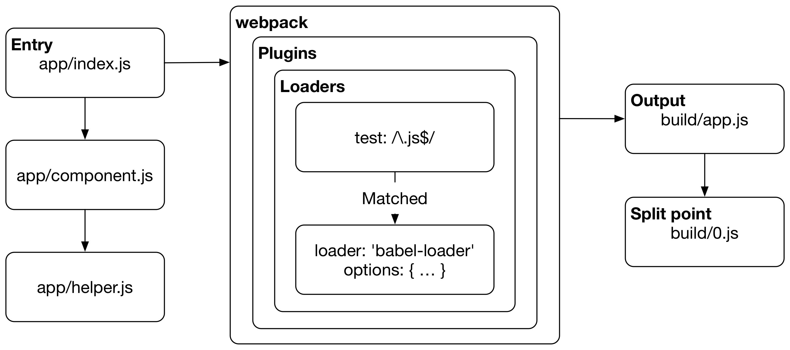

# Webpack是什么

Webpack是一个 **模块化打包工具**。Webpack可以像单任务运行工具一样的打包功能。可是，由于Webpack社区提供的插件使打包工具和任务运行工具间的区别变得模糊起来。有时这些插件执行webpack之外的任务，例如：清除打包生成目录或发布打包生成目录文件到服务器。

React和 **热交换** (HMR) 使webpack流行起来。webpack也可以被用在其他开发环境中, 如： [Ruby on Rails](https://github.com/rails/webpacker)。与名字无关，webpack不仅仅只用在Web中，它可以有不同的打包对象, 具体的将在 *构造对象* 章节来讲。

> 如果你想要更为详细的理解构造工具和它们的历史，可以在 *构造工具的比较* 这个附录中查找。

## Webpack为模块化的文件而存在

用Webpack打包一个项目，至少需要 **input** 和 **output** 两部分。打包从用户定义的 **entries** 开始（项目所有模块文件入口）。可以是 **模块** 它们本来的名字，也可以是用 **imports** 导入模块后，模块的别名。

当你用webpack打包一个项目时，它遍历所有的引入模块后，形成一个项目的 **依赖关系图** ，然后根据配置经行 **输出**。此外, 根据定义的 **分离节点** 来生成分离模块。

Webpack支持 ES2015，CommonJS 和 AMD 的模块引入语法。**loader** 中的 *css-loader* 能很好的处理css，支持 `@import` 和 `url()` 的语法引入css模块。你也可以用插件来完成指定的功能，如：压缩，国际化, HMR等等。

> 依赖关系图用来描述各个模块节点间的关系。这里关系图的定义是通过文件间的引用 (`require`, `import`)来定义的。Webpack静态的遍历项目中的模块文件来生成关系图，而不执行这些模块文件。

## Webpack的执行过程



Webpack从 **entries** 开始工作。通常这些入口通常是JavaScript模块，webpack在这些模块里执行遍历过程。在这个过程中, webpack计算入口匹配的 **loader** ，然后这个 **loader** 的配置告诉webpack如何进行转换。


### 解析过程

入口它自身就是一个模块。当webpack遇到一个模块时，webpack用入口的 `resolve` 配置来匹配文件系统。除了 *node_modules* 目录外，你可以为webpack指定任意的遍历目录。 webpack派出了匹配文件扩展名的方式, 你可以为目录定义别名。*NPM依赖* 这章将有详细的介绍。

如果webpack解析遇到失败，将报一个运行时错误。如果webpack解析模块正确，webpack将根据loader的配置来匹配模块。每个loader只对特定模块的内容进行转换。

loader匹配解析后的模块的配置方式有多种，包括模块（文件）和的类型和在文件系统中的位置。webpack甚至允许你根据模块从项目中的引入位置来对其转换模块。

webpack的loader执行相同的解析过程。Webpack允许你在决定使用哪个loader时应用类似的逻辑。由于这个原因，loader有自己的配置。如果webpack未能执行loader查找，它将引发一个运行时错误。

> 为了实现解析目的, webapck依赖 [增强的 `resolve`](https://www.npmjs.com/package/enhanced-resolve)。

### Webpack可以解析任何类型的文件

Webpack将解析它在构建依赖关系图时遇到的每个模块。如果入口包含依赖项，则递归地对每个依赖执行该流程，直到遍历完成为止。Webpack可以对任何文件类型执行解析，不像Babel或Sass编译器这样的专用工具。

Webpack让你可以处理遇到的各种静态资源，如：你可以用 **内联的形式** 将静态资源放到JavaScript包（最终生成的文件）中来减少请求。Webpack还允许使用CSS模块这样的技术将样式与组件相结合，并避免出现标准的CSS样式问题。正是这种灵活性使得webpack更有价值。

虽然webpack主要用于打包JavaScript，但是它也可以捕获像图篇、字体这样的静态资源，然后将它们最终的打包文件中分离出来形成单独的文件。入口是打包这个过程的起点，输出的内容取决于你的配置。

### 评估过程

假设所有的loader被找到，webpack依次通过每个loader运行模块时，从底部到顶部，从右到左（`styleLoader(cssLoader('./main.css'))`）评估匹配的loader。最终，你得到Webpack注入到 **bundle** 的结果。*loader 定义* 这章节将详细介绍这一块儿。

如果所有loader评估过程中没有出现运行时错误，Webpack将把所有的文件打包到一个文件中（包）。**Plugins** 允许你在打包过程的不同阶段拦截 **runtime events** 。

虽然loader可以做很多工作，但它们不能提供足够的动力来完成高级任务。插件可以拦截webpack应用的 **runtime events**。一个很好的例子是当 `MiniCssExtractPlugin` 与loader一起使用时，分离css到独立的文件中。如果没有这个步骤，CSS将被内嵌在生成的JavaScript中，因为webpack默认将所有代码视为JavaScript。在 *分离CSS* 这章中将介绍‘提取’思想。

### 输出

每个模块被评估过之后，webpack将执行 **output**。输出包含一个启动脚本（bundle.js）和一个 manifest（它用来描述在浏览器中，启动脚本应该如何运行。manifest可以独立出来形成一个文件，本书将稍后进行讲解。构建目标不同输出也将不同(web不是唯一的选择。

这不是打包过程的全部内容。例如，你可以定义特定的 **分割点** ，webpack可以根据应用的逻辑生成不同的打包文件。这个思想将在 *代码分离* 这章中讲解。

## Webpack是配置驱动型的工具

At its core, webpack relies on configuration. 这个例子被 [webpack官方指南](https://webpack.js.org/get-started/)采纳，包含如下几个配置项:

**webpack.config.js**

```javascript
const webpack = require("webpack");

module.exports = {
  // 打包开始位置
  entry: {
    app: "./entry.js",
  },

  // 输出位置
  output: {
    // 输出到根目录
    path: __dirname,

    // 捕获入口的名字，并使用它
    filename: "[name].js",
  },

  // 定义如何处理所有遇到的的引入模块
  module: {
    rules: [
      {
        test: /\.css$/,
        use: ["style-loader", "css-loader"],
      },
      {
        test: /\.js$/,
        use: "babel-loader",
        exclude: /node_modules/,
      },
    ],
  },

  // 执行额外的处理
  plugins: [
    new webpack.DefinePlugin({ ... }),
  ],

  // 根据 Resolution algorithm 定义模块别名
  resolve: {
    alias: { ... },
  },
};
```

有时Webpack的配置模型会让人感觉有点不透明，因为配置文件看起来像是一个整体，除非你知道webpack背后的原理，否则很难理解它在做什么。本书存在的主要目的之一，是提供调整配置的方法。

## 带hash的静态资源

用webpack，你可以为每一个包名注入一个hash(如, *app.d587bbd6.js*) ，去校验客户端的报是否有效。在理想的情况下，`包分离` （一个大的压缩文件分成几个小的压缩文件） 允许客户端之家在一小部分数据。

## 热交换

你可能已经熟悉一些工具，如[LiveReload](http://livereload.com/) 或 [BrowserSync](http://www.browsersync.io/)。这些工具在你修改代码时会自动刷新浏览器。 *热交换* (HMR) 则更进一步。在React中，它允许应用程序在不强制刷新的情况下保持其状态。虽然这听起来并无特别之处，但实际上却大不相同。

HMR也可以在Browserify中通过 [livereactload](https://github.com/milankinen/livereactload) 来实现，因此他不是webpack所独有的。

## 代码分离

除了HMR之外，webpack还有其他很多功能。Webpack允许你用不同的方式来分割代码。甚至当你的程序执行时，可以实现动态加载，这种懒加载因为可以根据需要动态加载，所以广泛的应用在应用程序中。

即使是小型应用程序也可以从代码分割这种技术中收益，因为它允许用户更快的获得可用的东西。抛开性能这个性不讲，了解基本的技术也是不错的。

## 总结

虽然Webpack的学习曲线比较陡峭，但是从长远角度来看，它是一个值得学习的工具，会节省不少开发的时间和精力。要了解它与其他工具的不同，可以查看[官方的对比](https://webpack.js.org/comparison/)。

Webpack并不能解决所有的问题，但是他确实解决了打包的问题。这减少了一个开发过程中的的担忧。使用 *package.json* 和 webpack 本身就可以让你的变成之路走的更远。

综上所述:

* Webpack是一个 **module bundler**，但你也可以用它来运行任务。
* Webpack依赖于 **依赖图** 工作。Webpack遍历所有的源文件生成依赖图，然后它根据这个依赖图结合配置来生成最终的文件。
* Webpack依赖 **loaders** 和 **plugins**。Loaders操作的是模块；plugins依赖webpack提供的钩子，并能很好的访问它的执行过程。
* Webpack的 **configuration** 描述了如何转换图形这样的静态资源，以及它应该如何输出。部分配置信息引入原类型的静态资源，如：**code splitting** 这样的功能被引入。
* **Hot Module Replacement** (HMR) 使webpack流行开来。这个功能可以在浏览器中更新代码，而不需要刷新整个页面，极大地增强了开发体验 。
* Webpack可以生成文件的同时生成一个 **hashes** ，当文件的内容发生改变时，这个对应的hashes也将发生变化。

在书的下一部分，你将学习如何使用webpack构建开发配置，同时了解更多关于它的基本概念。

> 如果你还不明白为什么需要打包工具——webpack, 可阅读[我为什么用webpack](http://tinselcity.net/whys/packers)。
