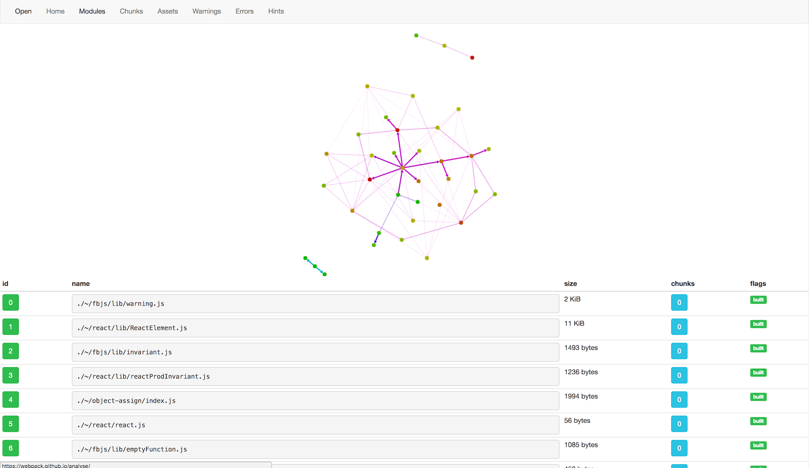
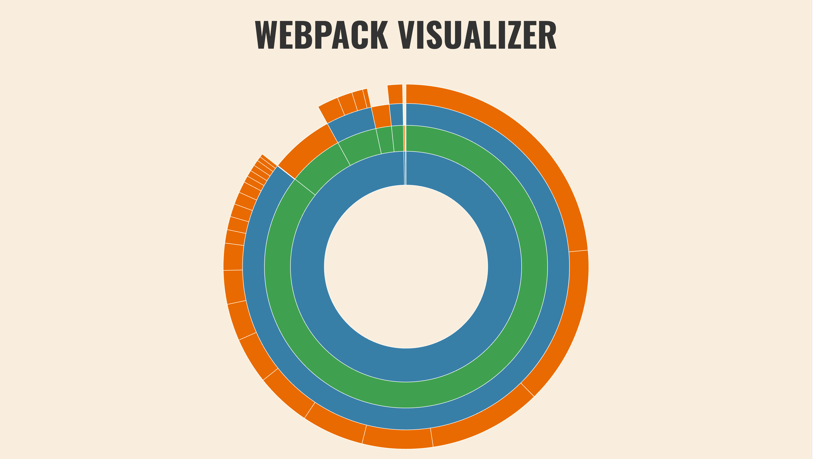
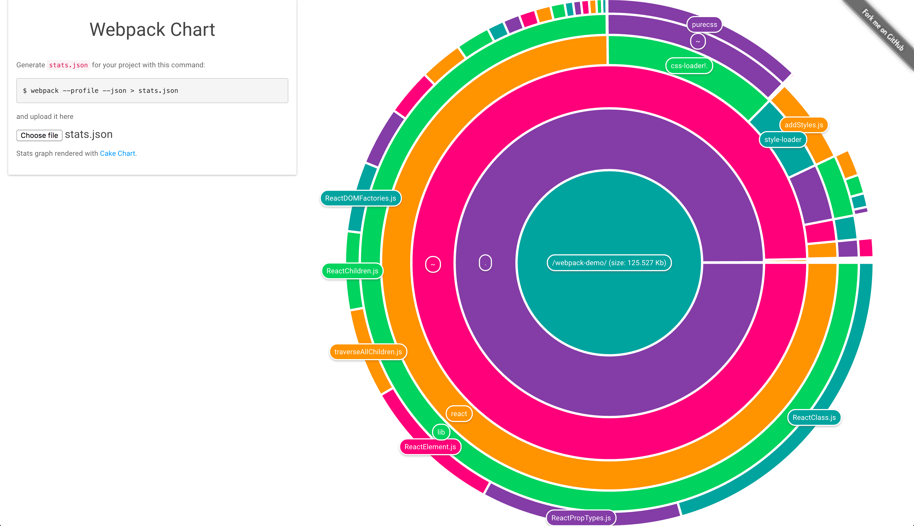
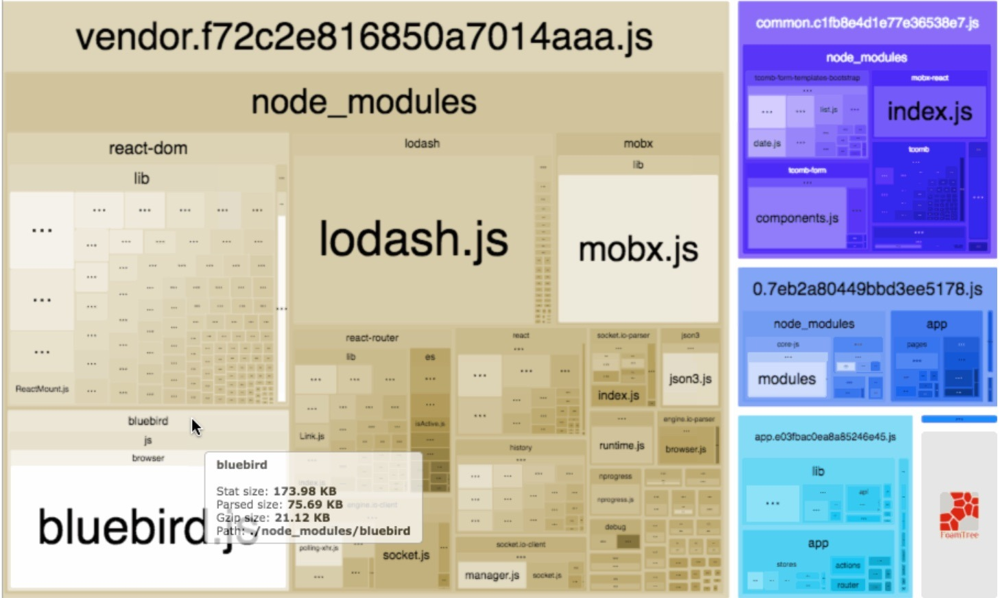
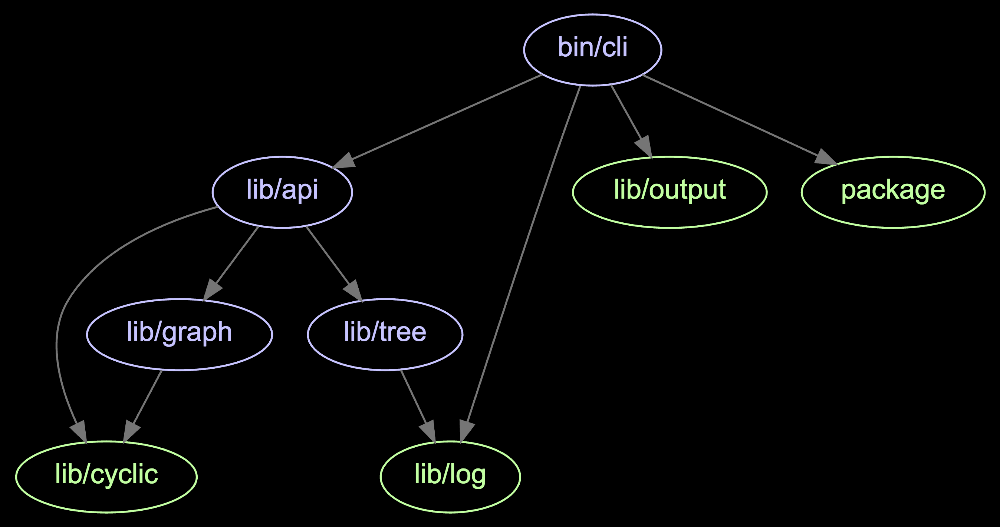

# 构建分析

分析构建统计信息是更好地理解webpack的一个重要步骤。可视化webpack输出，将帮助你了解构建包的组成。

## 配置Webpack

要获得合适的输出，你需要对配置进行一些调整。至少应该设置 `--json` 标志并将输出传递给文件，如下所示：

**package.json**

```json
"scripts": {
  "build:stats": "webpack --env production --json > stats.json",
  ...
},
```

以上是你需要的基本设置，无论你的webpack配置如何。现在执行 `npm run build：stats` 脚本命令，等待一段时间，你应该在你的项目根目录找到 `stats.json` 。可以通过各种工具读取此文件，以便更好地了解构建发生的事情。

当然，你可以考虑使用以下参数：

* `--profile` 捕获与时间相关的信息。该参数是可选的，但它是好用的。
* `--progress` 显示webpack在构建的不同阶段花了多长时间。

> 要理解webpack在处理时为什么包含用于构建的特定模块。可使用 [whybundled](https://www.npmjs.com/package/whybundled) 或 [webpack-why](https://www.npmjs.com/package/webpack-why) 插件。 `--display-reasons` 参数可以提供更多的信息。如：`npm run build -- --display-reasons` 。

> 鉴于你在当前配置中使用生产模式，这个过程需要清理构建目录！如果要避免这种情况，请设置一个不清理的单独目标。

### Node API

可以通过Node捕获统计信息。由于统计信息可能包含错误，因此分开处理该情况是个好主意：

```javascript
const webpack = require("webpack");
const config = require("./webpack.config.js")("production");

webpack(config, (err, stats) => {
  if (err) {
    return console.error(err);
  }

  if (stats.hasErrors()) {
    return console.error(stats.toString("errors-only"));
  }

  console.log(stats);
});
```

如果你正在寻找有关统计数据的进一步处理，此技术可能很有用。

> 如果你想要一个 `stats` 的JSON输出，使用 `stats.toJson()` 。为了获得 `verbose` 输出，可使用 `stats.toJson("verbose")`。它遵循webpack支持的所有 `stat` 选项。

> 为了模仿 `--json` 参数，使用 `console.log(JSON.stringify(stats.toJson(), null, 2));`。输出的格式是可读的。

### `StatsWebpackPlugin` 和 `WebpackStatsPlugin`

如果你想要使用一个插件来管理状态输出，可考虑 [stats-webpack-plugin](https://www.npmjs.com/package/stats-webpack-plugin) 。它使你可以更多地控制输出。你可以使用它从输出中排除特定的依赖项。

[webpack-stats-plugin](https://www.npmjs.com/package/webpack-stats-plugin) 是其他一个选择。它允许你在输出数据之前转换数据。

## 启用webpack的性能预算策略

Webpack 允许你定义一个 **performance budget**。这个想法是它给出了你必须遵循的构建大小约束。默认情况下会提取该功能，并包含用于输入计算的块。如果它有问题，它将终止整个构建。

要将该功能集成到项目中，可参考如下配置：

**webpack.config.js**

```javascript
const productionConfig = merge([
  {
    performance: {
      hints: "warning", // "error" or false are valid too
      maxEntrypointSize: 50000, // in bytes, default 250k
      maxAssetSize: 450000, // in bytes
    },
  },
  ...
]);
```

在实践中，你希望保持下限。目前这些足以进行此演示。如果运行 `npm run build` 脚本命令，你将看到一个警告输出：

```bash
WARNING in entrypoint size limit: The following entrypoint(s) combined asset size exceeds the recommended limit (48.8 KiB). This can impact web performance.
Entrypoints:
  main (103 KiB)
      manifest.3fd9a1eb.js
      manifest.d41d8cd9.css
      vendor.0a4df2ff.js
      vendor.3dd53418.css
      main.9043ef51.js
      main.d5d711b1.css
```

你可以增加限制或删除配置以消除警告。一个有吸引力的选择是用 [*使用包*](https://lvzhenbang.github.io/webpack-book/zh/techniques/06_consuming.html) 章节中讨论的使用轻量级的React。

## 可用的分析工具

即使查看文件本身也可以让你了解正在发生的事情。请参考以下内容。

### 官方分析工具



[官方分析工具](https://github.com/webpack/analyse) 为你提供建议，并了解应用程序的依赖关系图。它也可以在本地运行。

### Webpack可视化工具



[Webpack可视化工具](https://chrisbateman.github.io/webpack-visualizer/) 提供一个饼图，显示构建输出的组成。

### `DuplicatePackageCheckerPlugin`

如果在你的构建中多次找到单个包，[duplicate-package-checker-webpack-plugin](https://www.npmjs.com/package/duplicate-package-checker-webpack-plugin) 会发出警告。否则这种情况很难发现。

### Webpack图表



[Webpack图表](https://alexkuz.github.io/webpack-chart/) 另一个类似的可视化工具。

### webpack-unused

[webpack-unused](https://www.npmjs.com/package/webpack-unused) 打印出未使用的文件，这些文件不再使用，可以从项目中删除。

### Stellar Webpack


[Stellar Webpack](https://alexkuz.github.io/stellar-webpack/) 提供基于Universe的可视化，并允许你以3D形式检查应用程序。

### webpack-bundle-tracker

[webpack-bundle-tracker](https://www.npmjs.com/package/webpack-bundle-tracker) 可以在webpack编译时捕获数据。它使用JSON来实现此目的。

### webpack-bundle-analyzer



[webpack-bundle-analyzer](https://www.npmjs.com/package/webpack-bundle-analyzer) 提供可缩放的树图。

### webpack-bundle-size-analyzer

[webpack-bundle-size-analyzer](https://www.npmjs.com/package/webpack-bundle-size-analyzer) 提供了基于文本的组合。

```bash
$ webpack-bundle-size-analyzer stats.json
react: 93.99 KB (74.9%)
purecss: 15.56 KB (12.4%)
style-loader: 6.99 KB (5.57%)
fbjs: 5.02 KB (4.00%)
object-assign: 1.95 KB (1.55%)
css-loader: 1.47 KB (1.17%)
<self>: 572 B (0.445%)
```

### inspectpack

[inspectpack](https://www.npmjs.com/package/inspectpack) 可用于确定要修改的特定代码位置。以下示例执行重复分析：

```bash
$ inspectpack --action=duplicates --bundle=bundle.js
## Summary

* Bundle:
    * Path:                /PATH/TO/bundle.js
    * Bytes (min):         1678533
* Missed Duplicates:
    * Num Unique Files:    116
    * Num Extra Files:     131
    * Extra Bytes (min):   253955
    * Pct of Bundle Size:  15 %
```

### Jarvis

[Jarvis](https://www.npmjs.com/package/webpack-jarvis) 是一个用户界面，旨在显示与你的webpack构建相关的所有信息。例如，它显示了如何处理不同的连接类型。

### webpack-runtime-analyzer

[webpack-runtime-analyzer](https://www.npmjs.com/package/webpack-runtime-analyzer) 提供webpack包的实时分析。你可以通过用户界面，包大小和模块详细信息查看多个图层。它将许多工具的功能组合到一个工具中。

### Webpack Monitor

[Webpack Monitor](http://webpackmonitor.com/) 是一个专注于清晰的用户界面的工具。可以就如何改进构建提出建议。

### webpack-deps-tree

[webpack-deps-tree](https://restrry.github.io/webpack-deps-tree/static/) 显示webpack模块图。使用它，你可以了解构建包的模块是如何相互关联的。

## Duplication Analysis

除了检查包之外，还有其他工具可用于计算重复项：

* [bundle-duplicates-plugin](https://www.npmjs.com/package/bundle-duplicates-plugin) 在函数级别上的使用。
* [find-duplicate-dependencies](https://www.npmjs.com/package/find-duplicate-dependencies) 在npm包级别上实现相似功能。
* 如果项目中缺少冗余依赖项或依赖项，[depcheck](https://www.npmjs.com/package/depcheck) 会进一步发出警告。
* [bundle-buddy](https://www.npmjs.com/package/bundle-buddy) 可以在包中找到重复项，同时提供用户界面来调整webpack代码拆分行为。[bundle-buddy-webpack-plugin](https://www.npmjs.com/package/bundle-buddy-webpack-plugin) 使它更加容易于使用。

## 独立工具

除了使用webpack输出的工具之外，还有一些与webpack无关的工具值得一提。

### source-map-explorer

[source-map-explorer](https://www.npmjs.com/package/source-map-explorer) 是一个独立于webpack的工具。它允许你使用映射深入了解你的构建。它提供了基于映射的可视化。

### madge



[madge](https://www.npmjs.com/package/madge) 是另一个独立的工具，可以输出基于模块输入的图形。图形输出允许你更详细地了解项目的依赖关系。

## 总结

当你优化构建输出的大小时，这些工具是非常宝贵的。官方工具具有最多的功能，但即使是基本的可视化也可以揭示问题点。你可以使用与旧项目相关的技术来了解它们的组成。

内容回顾：

* Webpack允许你提取一个包含有关构建信息的JSON文件。数据可以包括构建组成和时间。
* 可以使用各种工具分析生成的数据。例如：构建组合。
* `**Performance budget**`允许你设置构建大小的限制。维持预算可以使开发人员注意到生成的构建包的大小。
* 了解构建包是理解如何优化整体规模、加载内容和时间的关键。 因此，它可以揭示更重要的问题，例如：冗余数据。
* 你可以使用不依赖于Webpack的第三方工具，它们对分析构建任然有价值。

在下一章中，将详细的介绍[webpack的性能](https://lvzhenbang.github.io/webpack-book/zh/optimizing/07_performance.html)。
