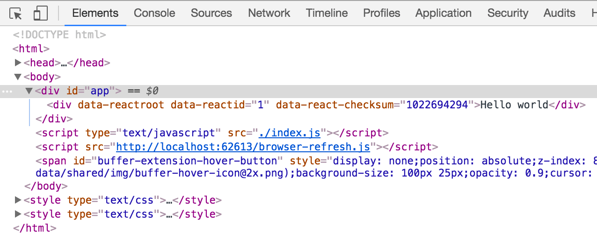

# 服务端渲染

**服务端渲染** (SSR) 是一种允许你使用HTML，JavaScript，CSS，甚至应用程序状态来提供初始有效负载的技术。即使没有启用JavaScript，你也可以提供完全呈现的HTML页面。除了提供潜在的性能优势外，这还有助于搜索引擎优化（SEO）。

这个想法不仅听起来不那么独特，还存在技术成本。这种方法由React推广。为了解决框架封装的棘手问题，如：[Next.js]（https://www.npmjs.com/package/next）和[razzle]（https://www.npmjs.com/package/razzle）的依赖出现了。

为了演示SSR，你可以使用webpack编译客户端构建，然后由服务器接收，该服务器遵循原则使用React呈现它。这样做足以了解它是如何工作的，以及问题。

> SSR 不仅解决了 SEO 的问题。**Prerendering** 也是一种可选择的技术，如果它适合你的用例，实现起来更容易。这种方法不适用于高动态数据。[prerender-spa-plugin]（https://www.npmjs.com/package/prerender-spa-plugin）允许你使用webpack实现它。

## 使用React配置Babel

* Loading JavaScript *章节介绍了使用Babel和webpack的基本要点。不过，你应该添加执行React特有的选项。考虑到大多数React项目依赖于[JSX]（https://facebook.github.io/jsx/）格式，你可以通过Babel启用它。

要让React，尤其是JSX与Babel一起工作，首先安装预设：

```bash
npm install @babel/preset-react --save-dev
```

像下面这样，在babel配置中引入react预设：

**.babelrc**

```json
{
  ...
  "presets": [
    "@babel/preset-react",
    ...
  ]
}
```

## 创建一个React示例

要确保项目具有有相关依赖，需安装React和[react-dom]（https://www.npmjs.com/package/react-dom）。然后定义一个包来将应用程序呈现给DOM。

```bash
npm install react react-dom --save
```

接下来，React代码需要一个小入口点。如果你在浏览器端，则应将 `Hello world``div` 挂载到文档中。要证明它有效，单击它应该弹出一个带有“hello”消息的对话框。在服务器端，返回React组件，服务器可以接收它。

修改 **src/ssr.js** 代码如下：

```javascript
const React = require("react");
const ReactDOM = require("react-dom");

const SSR = <div onClick={() => alert("hello")}>Hello world</div>;

// Render only in the browser, export otherwise
if (typeof document === "undefined") {
  module.exports = SSR;
} else {
  ReactDOM.hydrate(SSR, document.getElementById("app"));
}
```

你仍然缺少webpack配置来将此文件转换为服务器可以接收的内容。

> 注意ES2015的import规范和CommonJS的export不能混合。入口点是用CommonJS规范编写的。

## 配置 Webpack

为了保持友好，我们将定义一个单独的配置文件。它已经完成了很多工作。考虑到你需要在多个环境中使用相同的输出，因此使用UMD作为库目标是有意义的：

**webpack.ssr.js**

```javascript
const path = require("path");
const merge = require("webpack-merge");

const parts = require("./webpack.parts");

const PATHS = {
  build: path.join(__dirname, "static"),
  ssrDemo: path.join(__dirname, "src", "ssr.js"),
};

module.exports = merge([
  {
    mode: "production",
    entry: {
      index: PATHS.ssrDemo,
    },
    output: {
      path: PATHS.build,
      filename: "[name].js",
      libraryTarget: "umd",
      globalObject: "this",
    },
  },
  parts.loadJavaScript({ include: PATHS.ssrDemo }),
]);
```

为了方便生成构建，可以添加下面这样一个脚本：

**package.json**

```json
"scripts": {
  "build:ssr": "webpack --config webpack.ssr.js",
  ...
},
```

运行 `npm run build:ssr` 脚本命令，你应该在 *./static/index.js* 中看到一个新文件。下一步是设置服务器来呈现它。

## 创建一个Server

为了清楚地理解，你可以配置一个独立的Express服务器来获取生成的构建生成包，并按照SSR原理呈现它。首先安装Express：

```bash
npm install express --save-dev
```

然后，为了运行一些东西，按如下方式实现服务器：

**server.js**

```javascript
const express = require("express");
const { renderToString } = require("react-dom/server");

const SSR = require("./static");

server(process.env.PORT || 8080);

function server(port) {
  const app = express();

  app.use(express.static("static"));
  app.get("/", (req, res) =>
    res.status(200).send(renderMarkup(renderToString(SSR)))
  );

  app.listen(port);
}

function renderMarkup(html) {
  return `<!DOCTYPE html>
<html>
  <head>
    <title>Webpack SSR Demo</title>
    <meta charset="utf-8" />
  </head>
  <body>
    <div id="app">${html}</div>
    <script src="./index.js"></scrip>
  </body>
</html>`;
}
```

运行 `node ./server.js` 脚本命令启动服务器，然后在浏览器中访问 `http://localhost:8080` ，你将看到如下的显示：


虽然现在可以运行React应用程序，但是使用它继续开发也不方便。如果你尝试修改代码，则不会发生任何事情。如本书前面所述，在multi-compiler模式下，运行webpack可以解决该问题。另一种选择是针对当前配置，使用 **监视模式** 运行webpack，同时也为服务器设置监视器。接下来将讲解如何实现。

> 如果你要调试输出的结果你可以设置为 `export DEBUG=express:application` 。

> 如果你按照 [*分离出一个清单*](https://lvzhenbang.github.io/webpack-book/dist/zh/optimizing/05_separating_manifest.html) 章节中的讲的那样编写manifest，则可以将对webpack生成的资产的引用自动写入服务器端模板。

## 监视 SSR 的改变，然后刷新浏览器

在终端中运行 `npm run build：ssr - --watch` 脚本，可以解决无法动态处理ssr.js变化的问题。这迫使webpack以监视模式运行。为方便起见，可以在npm脚本中实现这个想法，这对于演示示例来说已经足够了。

如何让服务器知道改变，以及如何将改变传递到浏览器？

[browser-refresh]（https://www.npmjs.com/package/browser-refresh）可以派上用场，因为它解决了这两个问题。

首先，在项目中安装这个依赖：

```bash
npm install browser-refresh --save-dev
```

需要对服务器代码进行两处小的修改：

**server.js**

```javascript
server(process.env.PORT || 8080);

function server(port) {
  ...

  // app.listen(port);
  app.listen(port, () => process.send && process.send("online"));
}

function renderMarkup(html) {
  return `<!DOCTYPE html>
<html>
  ...
  <body>
    ...
    <script src="${process.env.BROWSER_REFRESH_URL}"></script>
  </body>
</html>`;
}
```

第一个修改告诉客户端应用程序已联机并准备就绪。后一个修改将客户端脚本附加到输出中。 * browser-refresh *管理有问题的环境变量。

另开一个客户端，执行 `node_modules/.bin/browser-refresh ./server.js` 脚本命令，然后再浏览器中访问 `http://localhost:8080` 。另开启一个终端，让webpack在监视模式下运行（`npm run build：ssr - --watch`）。 如果一切正常，你对演示客户端脚本（`app/ssr.js`）所做的任何更改，都将显示在浏览器中。

如果服务器崩溃，则会丢失WebSocket连接。在这种情况下，你必须在浏览器中强制刷新。如果服务器也是通过webpack管理的，那么问题就可以避免。

要证明SSR有效，请查看浏览器检查器。你应该看到熟悉的东西：



在 `div` 中不仅可以挂载应用程序，你还可以在那里看到所有相关的HTML。这种特殊情况并不多，但它足以展示这种方法。

> 可以通过为服务器实现生产模式来进一步改进，该模式将至少跳过注入浏览器刷新脚本。服务器可以将初始数据有效负载注入生成的HTML中。 这样做可以避免客户端的查询。

## Open Questions

尽管该示例演示了SSR的基本概念，但它仍然存在悬而未决的问题：

* 如何处理样式？ Node不理解CSS相关的导入。
* 如何处理除JavaScript之外的任何事情？如果服务器端是通过webpack处理的，那么这不是一个问题，因为你可以在webpack上修补它。
* 如何通过Node之外的其他东西运行服务器？一种选择是将Node实例包装在服务中，然后通过主机环境运行。理想情况下，结果将被缓存，你可以为每个平台找到更具体的解决方案。

像这样的问题就是Next.js或razzle等解决方案存在的原因。它们旨在解决这些特定于SSR的问题。

> 路由是它自己解决的一个大问题，如：Next.js这样的框架。Patrick Hund在[Universal JavaScript Apps with React Router 4]（https://ebaytech.berlin/universal-web-apps-with-react-router-4-15002bb30ccb）文章中讨论了如何解决该问题。

## 总结

SSR带来了技术挑战，因此围绕它出现了特定的解决方案。Webpack非常适合SSR设置。

内容回顾：

* 服务器端渲染可以为浏览器提供更多初始化渲染。你可以立即显示标记，而不是等待JavaScript加载。
* 服务器端渲染还允许你将初始数据的有效负载传递到客户端，以避免对服务器进行不必要的查询。
* Webpack可以管理的客户端的部分实现。如果需要更集成的解决方案，它也可用于生成服务器，如：Next.js（它实现了这些细节）。
* 服务器端渲染不是没有成本的，它会导致新的问题，因为你需要更好的方法来处理这方面的问题，如：样式或路由。服务器和客户端环境的基本方式不同，因此编写代码需要注意，以使其不依赖于特定平台的功能。
