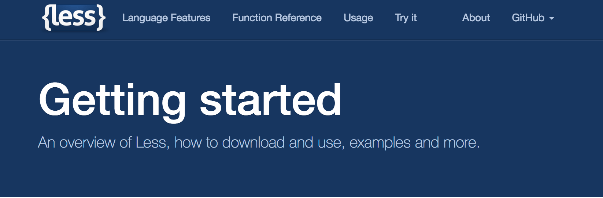
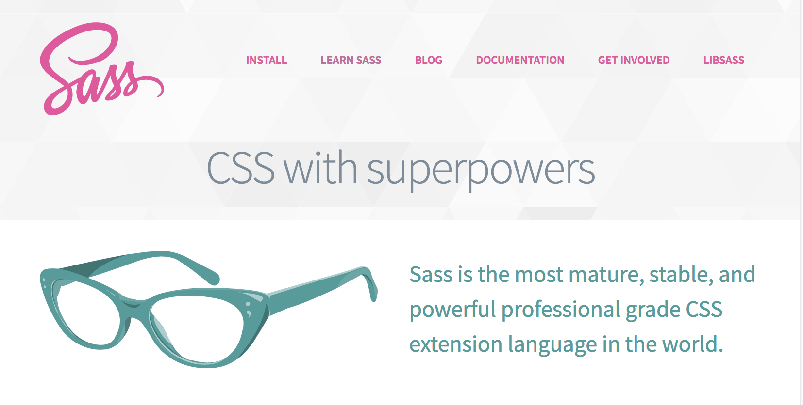
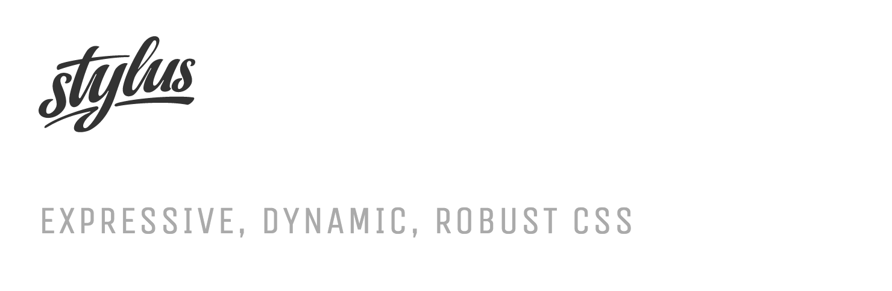

# 加载样式

因为不能在Webpack之外处理样式，因此你不得不用loaders和plugins加载样式文件。在这一章，你将在项目中配置css，看看它如何在浏览器中自动刷新。当你改变css时，不用强制刷新全部。此外，实现css的自动补全。

## 加载 CSS

为了加载css文件，你需要用 [css-loader](https://www.npmjs.com/package/css-loader) 和 [style-loader](https://www.npmjs.com/package/style-loader)。 *css-loader* 遍历查找所有的 `@import` and `url()` 引入的文件，对待他们就像 ES2015 `import` 一样。如果有 `@import` 引入项目外部的资源， *css-loader* 将跳过它，因为webpack只能处理项目内部资源。

*style-loader* 将文件中的样式注入到 `style` 元素内。这种实现方式可以被自定义，它实现的 *Hot Module Replacement* 接口，提供了一个令人愉快的开发体验。

匹配的文件也可以被 [file-loader](https://www.npmjs.com/package/file-loader) 和 [url-loader](https://www.npmjs.com/package/url-loader) 处理, 这些内容将在书中的 *Loading Assets* 部分讲解。

由于内联css（将css样式打包到于js文件中），在生产中不是一个好的想法，而用 `MiniCssExtractPlugin` 插件将所有的样式打包到一个独立的css文件中是很有意义的。这将在下一章中实现。


首先，引入相关依赖

```bash
npm install css-loader style-loader --save-dev
```

现在让我们来确定webpack已经知道了他们的存在。在末尾部分定义如下一个新函数:

**webpack.parts.js**

```javascript
exports.loadCSS = ({ include, exclude } = {}) => ({
  module: {
    rules: [
      {
        test: /\.css$/,
        include,
        exclude,

        use: ["style-loader", "css-loader"],
      },
    ],
  },
});
```

你也需要链接初始的配置片段:

**webpack.config.js**

```javascript
const commonConfig = merge([
  ...
leanpub-start-insert
  parts.loadCSS(),
leanpub-end-insert
]);
```

添加的配置的意思是，以 `.css` 结尾的文件应该调用给定的loaders。`test` 匹配一个js风格的正则表达式。

Loaders是一个转换器，它将源文件转换成新的源文件，这些新的源文件像一条链子一样被穿了起来，就像Unix中的管道一样。它们被评估（验证）的方向是自右向左，这意味着 `loaders: ["style-loader", "css-loader"]` 读起来可能是 `styleLoader(cssLoader(input))` 的样子。

> 如果你不想处理 `url` ，可以在 *css-loader*  设置配置为 `url: false`，同理你也可以设置 `@import` 的。你不想处理标准的 ES6 的 `import` ，你可以设置loader的配置项t `import: false`。

> 如果你不需要 HMR 功能，同时需要ie支持source-maps，你可以考虑用 [micro-style-loader](https://www.npmjs.com/package/micro-style-loader) 代替 *style-loader*.

## 添加初始化的CSS

定义一个 **src/main.css** 文件，代码如下： 

```css
body {
  background: cornsilk;
}
```

在入口文件 **src/index.js** 中，引入 **src/main.css** 文件：

```javascript
leanpub-start-insert
import "./main.css";
leanpub-end-insert
...
```

执行 `npm start` ，然后在浏览器地址栏中输入 `http://localhost:8080` ，然后按下回车键，紧接着打开 *main.css* 并改变背景颜色值为任意值，如：`lime` (`background: lime`)。

到这里，你学习了样式相关的技术，下一章将紧接这里来讲。


> 附录中的 *CSS Modules* 部分介绍了一种允许你处理本地文件的默认方法。它避免了css作用于的问题。

## 加载 Less



[Less](http://lesscss.org/) 是一个充满函数化特性的 CSS 处理器。webpack 不用花费大量精力处理less, 这个繁重的任务由 [less-loader](https://www.npmjs.com/package/less-loader) 完成。你应该安装 [less](https://www.npmjs.com/package/less) 的 *less-loader* （注意：与webpack同系列的版本）。

配置修改如下:

```javascript
{
  test: /\.less$/,
  use: ["style-loader", "css-loader", "less-loader"],
},
```

`less-loader` 支持 Less 插件，source-map等等。具体使用可阅读[less](https://github.com/webpack-contrib/less-loader/blob/master/README.md)

## 加载 Sass



[Sass](http://sass-lang.com/) 是一款被广泛使用的 CSS 预处理器。你可以用 [sass-loader](https://www.npmjs.com/package/sass-loader) 处理它。记住安装它同系列的 [node-sass](https://www.npmjs.com/package/node-sass) 依赖。

配置修改如下：

```javascript
{
  test: /\.scss$/,
  use: ["style-loader", "css-loader", "sass-loader"],
},
```

> 如果你有一个更高的性能需求，你可以尝试 [fast-sass-loader](https://www.npmjs.com/package/fast-sass-loader).

## 加载 Stylus 和 Yeticss



[Stylus](http://stylus-lang.com/) 也是一款 CSS 处理器。你可以用 [stylus-loader](https://www.npmjs.com/package/stylus-loader) 处理它。 [yeticss](https://www.npmjs.com/package/yeticss) 以库的形式被使用。

配置修改如下：

```javascript
{
  ...
  module: {
    rules: [
      {
        test: /\.styl$/,
        use: [
          "style-loader",
          "css-loader",
          {
            loader: "stylus-loader",
            options: {
              use: [require("yeticss")],
            },
          },
        ],
      },
    ],
  },
},
```

在Stylus中使用Yeticss，你一定要在你的 *.styl* 文件中引入它：

```javascript
@import "yeticss"
//or
@import "yeticss/components/type"
```

## PostCSS


[PostCSS](http://postcss.org/) 转换到 CSS 通过js插件。你甚至可以找到类Sass风格的插件。PostCSS 就是样式界里的 Babel。你可以在webpack中使用 [postcss-loader](https://www.npmjs.com/package/postcss-loader)。

下面的例子讲述了css-rule自动补充前缀的实现，它使用PostCss来实现配置。同时它配置了一个 [precss](https://www.npmjs.com/package/precss) 插件，该插件允许你写类Sass风格的样式。你也可以使用其他loader实现自动补全前缀，然后结合PostCss一起来使用。

```javascript
{
  test: /\.css$/,
  use: [
    "style-loader",
    "css-loader",
    {
      loader: "postcss-loader",
      options: {
        plugins: () => ([
          require("autoprefixer"),
          require("precss"),
        ]),
      },
    },
  ],
},
```

在这之前，你应该先引入 [autoprefixer](https://www.npmjs.com/package/autoprefixer) 和 [precss](https://www.npmjs.com/package/precss) 这两个依赖。这个技术将在 *Autoprefixing* 这一章详细介绍。

> PostCSS 支持 *postcss.config.js* 这样的配置形式。它的内部依赖 [cosmiconfig](https://www.npmjs.com/package/cosmiconfig) 来支持其他格式。

### cssnext

[cssnext](http://cssnext.io/) 是一个 PostCSS 插件，它实现在一定限制下体验未来的css。你可以使用它，通过引入 [postcss-cssnext](https://www.npmjs.com/package/postcss-cssnext) 依赖并启动它，配置如下：

```javascript
{
  use: {
    loader: "postcss-loader",
    options: {
      plugins: () => [require("postcss-cssnext")()],
    },
  },
},
```

参考 [cssnext 官方文档](http://cssnext.io/usage/)，了解好用的配置项。

> cssnext 包含 *autoprefixer* 功能! 所以你使用它的时候不用，额外的添加autoprefixer实现。

## 理解查找机制（Understanding Lookups）

为了充分的历用 *css-loader*，你应该了解它的查找机制是如何执行的。虽然在默认情况下*css-loader* 执行相对导入，但是它也不会影响绝对导入("url('/static/img/demo.png')")。如果依赖于这种导入方式（绝对导入），你将需要复制一份文件到项目中。

[copy-webpack-plugin](https://www.npmjs.com/package/copy-webpack-plugin) 工作为这种情况，同样你也可以赋值webpack之外的文件。前一种方法的好处是webpack-dev-server 可以从中获益。

> [resolve-url-loader](https://www.npmjs.com/package/resolve-url-loader)在你使用Sass或Less的时候会派上用场。它为环境添加了对相对导入的支持。

### *css-loader* 定制化处理导入（Processing *css-loader* Imports）

如果你想 *css-loader* 按照指定的方式处理引入的文件，你应该对配置项的 `importLoaders` 进行设置，选项值为一个数字，这个数字代表 *css-loader* 在处理引入的文件之前有几个loader已经执行。 如果你从源文件（css类型）中，使用 `@import` 语法引入了不同类型的css文件，并且你想制定的loader处理制定的css文件的话，那么你需要使用这个技术。

接上面的配置，在 `./main.css` 中引入一个sass文件:

```css
@import "./variables.sass";
```

添加处理sass文件的配置:

```javascript
{
  test: /\.css$/,
  use: [
    "style-loader",
    {
      loader: "css-loader",
      options: {
        importLoaders: 1,
      },
    },
    "sass-loader",
  ],
},
```

如果你想添加更多的loader，如：*postcss-loader*，你需要根据需求来调整 `importLoaders`。

### 从 *node_modules* 目录中加载

你也可以直接从 node_modules 目录中加载。以 Bootstrap 为例：

```less
@import "~bootstrap/less/bootstrap";
```

这个波浪号 (`~`) 告诉webpack这不是默认的相对引入。如果添加了这个波浪号，webpack的查找目标就是 `node_modules` （这是一个默认设置），但你可以通过 [resolve.modules](https://webpack.js.org/configuration/resolve/#resolve-modules) 来修该指代的目录。

W> 如果你使用 *postcss-loader* ，你可以跳过使用 `~` ，具体原因可阅读 [postcss-loader issue tracker](https://github.com/postcss/postcss-loader/issues/166)。 *postcss-loader* 解析了引入路径中的波浪号。

## 开启 Source-Maps

如果你想要CSS使用source-map，你需要配置 *css-loader* 的 `sourceMap` 选项来开启这个功能，并 设置 `output.publicPath` 的路径为你的开发服务器路径。如果你链式的使用多个loader，你需要为所有的loader开启 `sourceMap`。*css-loader* 这个问题 [issue 29](https://github.com/webpack/css-loader/issues/29) 的深度讨论。

## 转化 CSS 为 Strings

Angular 2 就是这样实现的，这样做是因为，你可以方便的操作哪些被传入组件中的字符串形式的css。[css-to-string-loader](https://www.npmjs.com/package/css-to-string-loader) 实现这个功能。

## 使用 Bootstrap

Webpack 有多种方法使用 [Bootstrap](https://getbootstrap.com/)。其中一种选择是 [npm version](https://www.npmjs.com/package/bootstrap) 然后执行上面配置的loader。

[Sass version](https://www.npmjs.com/package/bootstrap-sass) 是其他一种选择。使用这种方式，你需要设置 *sass-loader* 的 `precision` 选项，它的值至少为8。有一个 [常见问题](https://www.npmjs.com/package/bootstrap-sass#sass-number-precision)，*bootstrap-sass* 官方给出了解释。

第三种选择使用 [bootstrap-loader](https://www.npmjs.com/package/bootstrap-loader)。它提供了很多功能，同时也支持自定义。

## 结论

Webpack可以加载多种格式的文件。以上讲的方法，在默认情况下将样式打包到Javascript包中。

回顾：

* *css-loader* 评估（验证是否存在） `@import` 和 `url()` 声明的样式文件。*style-loader* 转换并注入到js文件中，提供webpack可使用的 *Hot Module Replacement* 热交换接口。
* Webpack 支持使用不同的loader来转换不同类型的样式文件到css。包含 Sass, Less, 和 Stylus类型。
* PostCSS 允许你在 CSS 中注入函数，同它的插件生态系统来完成转换。cssnext 是一个支持未来css样式的插件集合，PostCSS可以引用它。
* *css-loader* 默认情况下不影响绝对引用。你可以通过 `importLoaders` 选项来自定义引入。你可以通过向路径开始注入波浪号(`~`)来引入 *node_modules* 目录的文件。
* 要使用 source-map，你必须设置 `sourceMap` 的配置为 true，如果你也使用了其它的样式loader，你也需要开启它们的 `sourceMap` 的配置。此外，你还需要设置 `output.publicPath` 的为开发服务起的绝对路径地址。
* 在webpack中使用 Bootstrap，你需要特别小心。你既可以使用普通的loader，也可以使用
`bootstrap-loader`。

虽然这里讲了足够多的用于开发模式的加载方案，但是用于生产模式并不理想。你将在下一章学习如何实现从源文件中分割CSS。
