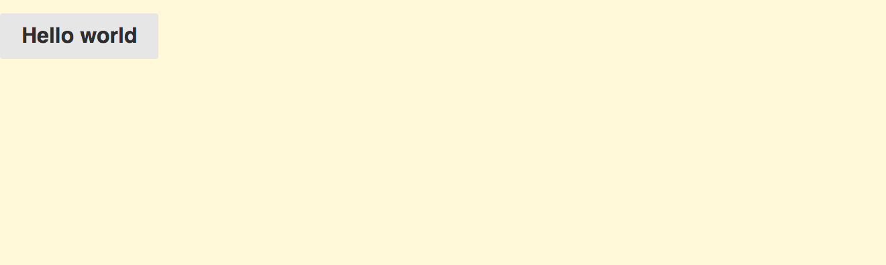

# 清除未用到的CSS

向 [Bootstrap](https://getbootstrap.com/) 这样的样式框架，它包含许多css模块。通常你只用一小部分，但是在打包的时候却打包了所有的样式，这时你需要考虑的就是如何清除未应用的样式。

[PurifyCSS](https://www.npmjs.com/package/purifycss) 这个工具可以通过分析这些样式文件，实现清除未用样式的目的。它是通过遍历样式代码，来实现找出哪些样式被应用了，但是你需要给它提供足够的信息来清除未应用的样式。

[uncss](https://www.npmjs.com/package/uncss)是PurifyCSS的一个很好的替代品。它通过PhantomJS进行操作，并以不同的方式来实现清除为应用的样式。可以把uncss作为PostCSS插件使用。

> 如果你使用 CSS 模块，你需要小心。你需要 **whitelist** 去建立所有选择起的联系（命名空间），在 [purifycss-webpack readme](https://github.com/webpack-contrib/purifycss-webpack#usage-with-css-modules) 有详细说明。

## Setting Up Pure.css

为了让这个demo更具有实际意义，你可以安装 [Pure.css] (http://purecss.io/)，它是一个小的css框架。引入它，然后你就可以看到PurifyCSS到底是如何工作的。尽管名字相似，但它们之间没有什么必然的联系。

```bash
npm install purecss --save
```

用 `import` 引入 Pure.css ：

**src/index.js**

```javascript
import "purecss";
...
```

> 在 *package.json* 中的Pure.css文件由于[resolve.mainFields](https://webpack.js.org/configuration/resolve/#resolve-mainfields)，会被webpack解析成`"browser": "build/pure-min.css",`这样的字段，然后import就可以成功的引入 pure.css 。在解析 `main` 之前，webpack会尽力解析 `browser` 和 `module` 字段。

在一个demo组件用使用 Pure.css 类选择器：

**src/component.js**

```javascript
export default (text = "Hello world") => {
  const element = document.createElement("div");

  element.className = "pure-button";
  element.innerHTML = text;

  return element;
};
```

如果你运行 `npm start` 脚本命令，你将看到 "Hello world" 具有了按钮的样式。



运行 `npm run build` 脚本命令，你会看到这样的输出：

```bash
Hash: 36bff4e71a3f746d46fa
Version: webpack 4.1.1
Time: 739ms
Built at: 3/16/2018 4:26:49 PM
     Asset       Size  Chunks             Chunk Names
   main.js  747 bytes       0  [emitted]  main
  main.css   16.1 KiB       0  [emitted]  main
index.html  220 bytes          [emitted]
...
```

正如你所看到的，样式文件变得很大，你可以使用 PurifyCSS 去优化它。

## 启用 PurifyCSS 功能

使用 PurifyCSS 可以让你的css文件变得足够小。pureCSS 和 最小的 Bootstrap（140kb）在项目中的类选择器使用率低于40%，也就是说，你如果使用Bootstrap的话，那么真正有效的样式只占35kb。所以使用PreifyCSS与否差距较大。

[purifycss-webpack](https://www.npmjs.com/package/purifycss-webpack) 可以实现类似的效果。你可以在 `MiniCssExtractPlugin` 中使用它，从而达到最好的效果。安装 [glob](https://www.npmjs.org/package/glob) 作为辅助：

```bash
npm install glob purifycss-webpack purify-css --save-dev
```

实现 PurifyCSS 的效果，首先你需要定义一个接口：

**webpack.parts.js**

```javascript
const PurifyCSSPlugin = require("purifycss-webpack");

exports.purifyCSS = ({ paths }) => ({
  plugins: [new PurifyCSSPlugin({ paths })],
});
```

下一步，合并配置。你要在 `MiniCssExtractPlugin` 之后引入purifyCSS，否则它将不工作：

**webpack.config.js**

```javascript
...
const path = require("path");
const glob = require("glob");

const parts = require("./webpack.parts");

const PATHS = {
  app: path.join(__dirname, "src"),
};

...

const productionConfig = merge([
  ...
  parts.purifyCSS({
    paths: glob.sync(`${PATHS.app}/**/*.js`, { nodir: true }),
  }),
]);
```

> 样式分离（css-extract-webpack-plugin）必须在样式净化（purifycss-webpack）之前。

此时，执行 `npm run build` 脚本命令，你将看到下面的输出：

```bash
Hash: 36bff4e71a3f746d46fa
Version: webpack 4.1.1
Time: 695ms
Built at: 3/16/2018 4:29:54 PM
     Asset       Size  Chunks             Chunk Names
   main.js  747 bytes       0  [emitted]  main
  main.css   2.07 KiB       0  [emitted]  main
index.html  220 bytes          [emitted]
...
```

样式文件明显减小了，从过去的16k到现在的2k。这对减小引入的css规模很有帮助。

PurifyCSS 支持的 [其他配置项](https://github.com/purifycss/purifycss#the-optional-options-argument) ，也包括 `minify` ，你可以在插件实例化时添加 `minimize: true` 配置项去启用它，默认是关闭的。 因为PurifyCSS不能处理你所用的所有类选择器，所以你可以考虑使用 `Options.whitelist` 数组定义了不管什么情况下，都应该保留的类选择器。

> 使用PurifyCSS将会丢弃source-maps，即使你在不同的特定功能的loader中启用了它，这是由PurifyCSS的底层工作机制决定的。

### 关键路径渲染

[critical path rendering](https://developers.google.com/web/fundamentals/performance/critical-rendering-path/) 这篇文章从不同的角度分析了CSS的性能。它不是讲如何优化文件的大小，而是讲如何优化css文件加载的顺序 它强调了 **above-the-fold** 的 CSS。通过分析显示的页面，然后确定使用哪些规则来得到想要的显示结果。

[webpack-critical](https://www.npmjs.com/package/webpack-critical) 和 [html-critical-webpack-plugin](https://www.npmjs.com/package/html-critical-webpack-plugin) 依赖于 `HtmlWebpackPlugin`插件来实现这个技术。[isomorphic-style-loader](https://www.npmjs.com/package/isomorphic-style-loader)  用webpack和React实现相似的结果。

[critical-path-css-tools](https://github.com/addyosmani/critical-path-css-tools) 是由Addy Osmani整理的工具集。

## 总结

用 PurifyCSS 可以是css文件明显的变小。它的主要价值是针对静态资源站点中引入了一个体积庞大CSS框架的优化。如果是一个动态站点或应用，它分析它们将变得困难起来。

内容回顾：

* PurifyCSS可以清除未使用的css。它具有分析静态资源的优势。
* 你可以通过引入 *purifycss-webpack* 来开启这个功能。这个插件需要在 `MiniCssExtractPlugin` 之后引用。
* At best, PurifyCSS can eliminate most, if not all, unused CSS rules.
* 关键路径渲染是其他一个css技术。针对above-the-fold的css，它强调首先引入的CSS。它的核心思想是渲染什么，就尽快的加载什么。

在下一章中，你讲了解 **autoprefix** 。启用该特性使开发复杂的CSS设置变得更加方便，这些CSS设置也可用于较老的浏览器。
