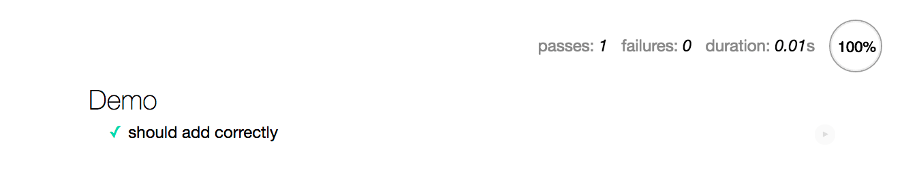
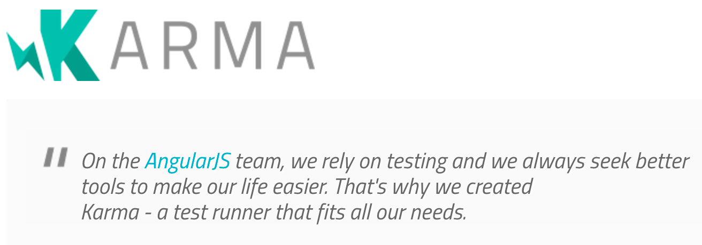
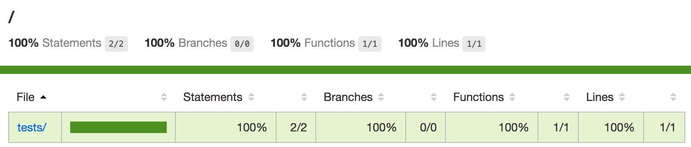

# 测试

测试是开发的重要部分。尽管linting等技术可以帮助发现和解决问题，但它们还有其局限性。测试可以应用于许多不同级别的代码和应用程序。

你可以 **单元测试** 一段特定的代码，或者你可以从用户的角度，通过 **验收测试来查看应用程序** 。 **集成测试** 适用于这两者，并关注单独的代码单元如何一起工作。

你可以找到很多JavaScript的测试工具。正确配置后，使它能适用于webpack。尽管测试工具在没有webpack的情况下工作，但通过webpack运行测试工具可以让你处理测试工具不了解的代码，同时控制模块的解析方式。你也可以使用webpack的监视模式，而不是依赖于测试工具提供的模式。

## Mocha


[Mocha](https://mochajs.org/)是流行的Node测试框架。虽然Mocha提供测试基础架构，但你必须将它断言。虽然 [Node`assert`](https://nodejs.org/api/assert.html)的功能已经足够，但是你也可以将它与其他断言库一起使用。

[mocha-loader](https://www.npmjs.com/package/mocha-loader)允许通过webpack运行Mocha测试。 [mocha-webpack](https://www.npmjs.com/package/mocha-webpack)是另一个提供了更多功能的可选工具。

### 在webpack中引入*mocha-loader*

首先，在项目中安装 Mocha 和 *mocha-loader* ：

```bash
npm install mocha mocha-loader --save-dev
```

### 创建一个代码测试demo

为了实现测试功能，你可以添加下面这样一个函数：

**tests/add.js**

```javascript
module.exports = (a, b) => a + b;
```

然后，为了测试它，设置一个小测试集合：

**tests/add.test.js**

```javascript
const assert = require("assert");
const add = require("./add");

describe("Demo", () => {
  it("should add correctly", () => {
    assert.equal(add(1, 1), 2);
  });
});
```

### 配置 Mocha

要针对测试运行Mocha，请添加如下脚本：

**package.json**

```json
"scripts": {
  "test:mocha": "mocha tests",
  ...
},
```

运行 `npm run test:mocha` 脚本命令，你将看到下面的输出：

```
Demo
  should add correctly


1 passing (5ms)
```

Mocha还提供了一种监视模式，你可以通过`npm run test：mocha - --watch` 脚本命令来激活。它在你修改代码时运行测试集合。

>  如果你只想关注一组特定的测试，`--grep <pattern>`可以用于约束测试的范围。

### 配置Webpack

Webpack可以通过Web界面提供类似的功能。本书前面已经解决了问题的难点，剩下的就是通过配置将这些解决方案结合起来。

要告诉webpack要运行哪些测试，需要以某种方式导入它们。[`动态加载`](https://lvzhenbang.github.io/webpack-book/dist/zh/techniques/01_dynamic_loading.html) 章节讨论了`require.context`，它允许根据规则聚合文件。设置入口点如下：
**tests/index.js**

```javascript
// Skip execution in Node
if (module.hot) {
  const context = require.context(
    "mocha-loader!./", // Process through mocha-loader
    false, // Skip recursive processing
    /\.test.js$/ // Pick only files ending with .test.js
  );

  // Execute each test suite
  context.keys().forEach(context);
}
```

webpack方面需要做一些小改动：

**webpack.mocha.js**

```javascript
const path = require("path");
const merge = require("webpack-merge");

const parts = require("./webpack.parts");

module.exports = merge([
  parts.devServer(),
  parts.page({
    title: "Mocha demo",
    entry: {
      tests: path.join(__dirname, "tests"),
    },
  }),
]);
```

> `devServer` 的配置可参考 [`组合配置`](https://lvzhenbang.github.io/webpack-book/dist/zh/developing/03_composing_configuration.html) 这章。 页面配置可参考 [`构建多页面应用`](https://lvzhenbang.github.io/webpack-book/dist/zh/output/02_multiple_pages.html) 这章.

在 **package.json** 中添加一个辅助脚本，以便快速启动：

```json
"scripts": {
  "test:mocha:watch":
    "webpack-dev-server --hot --config webpack.mocha.js",
  ...
},
```

> 如果你需要进一步了解 `--hot` 如何工作，可参考附录中的 `热模块交换` 。

如果你现在执行脚本快捷，并导航到 `http//localhost:8080/`，你可以看到下面这样的测试效果：



调整测试或代码，可导致浏览器发生变化。你可以在查看测试状态的同时，扩展规范或重构代码。

与vanilla Mocha配置相比，通过webpack配置Mocha具有以下几个优点：

* 可以调整模块分辨率。Webpack别名和其他技术可供使用，但这也会将代码绑定到webpack。
* 你可以使用webpack的处理来编译代码。使用vanilla Mocha，意味着你额外更多的自定义配置。

在缺点方面，需要一个浏览器来检查测试。`mocha-loader` 是一个最好的开发助手。

## Karma && Mocha



[Karma](https://karma-runner.github.io/) 是一个测试运行器，允许你在真实设备上运行测试和[PhantomJS](http://phantomjs.org/)，一个headless浏览器。 [karma-webpack](https://www.npmjs.com/package/karma-webpack) 是一个Karma预处理器，允许你将Karma与webpack连接。与之前相比，它对测试环境有了更多的控制。

首先，在项目中安装 Karma、Mocha、`karma-mocha` 和 `karma-webpack`：

```bash
npm install karma mocha karma-mocha karma-webpack --save-dev
```

与webpack一样，Karma也依赖于配置。按如下方式设置文件，使它获取测试：

**karma.conf.js**

```javascript
const parts = require("./webpack.parts");

module.exports = config => {
  const tests = "tests/*.test.js";

  config.set({
    frameworks: ["mocha"],
    files: [
      {
        pattern: tests,
      },
    ],
    preprocessors: {
      [tests]: ["webpack"],
    },
    webpack: parts.loadJavaScript(),
    singleRun: true,
  });
};
```

> 配置会为每个测试生成一个包。 如果你有大量的测试，并希望提高性能，那么就像上面的Mocha一样设置`require.context`。详情可参考 [karma-webpack issue 23](https://github.com/webpack-contrib/karma-webpack/issues/23) 。

添加如下所示的脚本命令快捷键：

```json
...
"scripts": {
  "test:karma": "karma start",
  ...
},
...
```

运行 `npm run test:karma` 脚本命令，在终端你将看到如下的输出：

```
...
webpack: Compiled successfully.
...:INFO [karma]: Karma v1.7.1 server started at http://0.0.0.0:9876/
```

以上意味着Karma正在等待，你必须访问该URL才能运行测试。 根据配置(`singleRun：true`)，Karma在此之后终止执行：

```
...
...:INFO [karma]: Karma v1.7.1 server started at http://0.0.0.0:9876/
...:INFO [Chrome 61...]: Connected on socket D...A with id manual-73
Chrome 61...): Executed 1 of 1 SUCCESS (0.003 secs / 0 secs)
```

鉴于运行测试这种方式会变得很烦人，可用用配置来完成。使用PhantomJS是一种选择。

> 你可以通过 `browsers` 字段，为Karma指定的浏览器。 如：`browsers：['Chrome']`。

### 用PhantomJS来运行测试

通过PhantomJS运行测试，你需要安装下面这样几个依赖项：

```bash
npm install karma-phantomjs-launcher phantomjs-prebuilt --save-dev
```

要通过Phantom用Karma运行测试，请按如下方式调整其配置：

**karma.conf.js**

```javascript
module.exports = config => {
  ...

  config.set({
    ...
    browsers: ["PhantomJS"],
  });
};
```

运行 `npm run test:karma` 脚本命令，你不需要访问url就可以看到如下的输出：

```
...
webpack: Compiled successfully.
...:INFO [karma]: Karma v1.7.1 server started at http://0.0.0.0:9876/
...:INFO [launcher]: Launching browser PhantomJS with unlimited concurrency
...:INFO [launcher]: Starting browser PhantomJS
...:INFO [PhantomJS ...]: Connected on socket 7...A with id 123
PhantomJS ...: Executed 1 of 1 SUCCESS (0.005 secs / 0.001 secs)
```

考虑到到当内容改变后，运行测试是无聊的，Karma提供了一种监视模式。

> PhantomJS尚不支持ES2015功能，因此你必须使用它们的预处理测试代码。计划为PhantomJS 2.5提供ES2015支持。

### Karma的监视模式

可以按如下方式启用Karma的监视模式：

**package.json**

```json
"scripts": {
  "test:karma:watch": "karma start --auto-watch --no-single-run",
  ...
},
```

你可以运行 `npm run test:karma:watch` 命令查看监视效果。

### 生成覆盖率报告

要了解测试涵盖的代码量，最好生成覆盖率报告。 这样做需要代码级检测。 此外，必须报告添加的信息，并且可以通过HTML和LCOV报告完成。

> LCOV与可视化服务完美集成。你可以通过持续集成环境(CI)将覆盖信息发送到外部服务，并在一个位置跟踪状态。

[isparta](https://www.npmjs.com/package/isparta)是一款流行的ES2015兼容代码的覆盖工具。将其与Karma连接需要配置。 最重要的是，代码必须通过[babel-plugin-istanbul](https://www.npmjs.com/package/babel-plugin-istanbul)进行检测。因为这样做需要少量的webpack配置。[karma-coverage](https://www.npmjs.com/package/karma-coverage)是报告问的题部分所必需的。

首先，安装相关依赖：

```
npm install babel-plugin-istanbul karma-coverage --save-dev
```

连接Babel插件，以便在运行Karma时，执行检测：

**.babelrc**

```json
...
"env": {
  "karma": {
    "plugins": [
      [
        "istanbul",
        { "exclude": ["tests/*.test.js"] }
      ]
    ]
  }
}
```

确保设置Babel环境，以便它获取插件：

**karma.conf.js**

```javascript
module.exports = config => {
  ...

  process.env.BABEL_ENV = "karma";

  config.set({
    ...
  });
};
```

> 如果你想详细的了解 `env` ，请参阅 [`Loading JavaScript`](https://lvzhenbang.github.io/webpack-book/dist/zh/loading/04_javascript.html) 一章。

在Karma上设置报告，然后将Karma配置与webpack连接。 `karma-webpack` 插件提供了两个可供使用的字段：`webpack` 和 `webpackMiddleware`。 在这种情况下，你应该使用前者来确保通过Babel处理代码。

**karma.conf.js**

```javascript
const path = require("path");

...

module.exports = config => {
  ...

  config.set({
    ...
    reporters: ["coverage"],
    coverageReporter: {
      dir: "build",
      reporters: [{ type: "html" }, { type: "lcov" }],
    },
  });
};
```

> 如果要将报告发送到 `dir` 下面的特定目录，请为每个报告设置 `subdir`。

执行 `npm run test:karma` 脚本命令，你应该在 `build` 下面看到一个包含覆盖率报告的新目录，同时你也可以通过浏览器查看测试HTML报告。



LCOV需要特定的工具才能工作。你可以找到Atom的[lcov-info](https://atom.io/packages/lcov-info)等编辑器插件。在使用监视模式进行开发时，正确配置的插件，可以为你提供你需要的覆盖信息。

## Jest


Facebook的[Jest](https://facebook.github.io/jest/)是一种配置自由的测试工具，它以最小的配置封装了功能，包括覆盖和模拟。它可以捕获数据的快照，使其对你有记录和保留项目的行为很有价值。

Jest测试遵循[Jasmine](https://www.npmjs.com/package/jasmine)测试框架的定义，它支持开箱即用的Jasmine风格的断言。特别是套件定义与Mocha足够接近，因此当前测试应该可以在不对测试代码本身进行任何调整的情况下工作。Jest提供了[jest-codemods](https://www.npmjs.com/package/jest-codemods)，用于将更复杂的项目迁移到Jest定义。

首先，安装 `jest` 依赖：

```
npm install jest --save-dev
```

Jest通过 `package.json`  [configuration](https://facebook.github.io/jest/docs/en/configuration.html)捕获测试。它检测 `__ tests __` 目录中的测试，也恰好捕获项目默认使用的命名模式：

**package.json**

```json
"scripts": {
  "test:jest:watch": "jest --watch",
  "test:jest": "jest",
  ...
},
```

现在你有两个新的快捷命令：一个运行测试一次，另一个在监视模式下运行它们。要捕获覆盖率信息，你必须在 `package.json` 中的`'jest'` 的选项中设置`"collectCoverage": true` 或将 `--coverage` 标志传递给Jest。默认情况下，它会在 `coverage` 目录下生成覆盖率报告。

鉴于生成覆盖率报告会带来性能开销，通过标志表示是否启用它，这样可能效果会更好。这样你就可以准确控制何时捕获信息。

将Webpack设置移植到Jest需要额外更多的努力，特别是如果你依赖webpack特定功能。[官方指南](https://facebook.github.io/jest/docs/en/webpack.html)涵盖了一些常见问题。你也可以配置Jest通过[babel-jest](https://www.npmjs.com/package/babel-jest)使用Babel，因为它允许你像使用[babel-plugin-module-resolver]( https://www.npmjs.com/package/babel-plugin-module-resolver)这样的Babel插件一样匹配webpack的功能。

> [jest-webpack](https://www.npmjs.com/package/jest-webpack)是一个提供了webpack和Jest之间集成的插件。

## AVA


[AVA](https://www.npmjs.com/package/ava)是一个旨在利用,并行执行测试的工具。它附带了自己的测试套件定义。 [webpack-ava-recipe](https://github.com/greyepoxy/webpack-ava-recipe) 介绍了如何将其与webpack配套使用。

AVA的主要思想是在监视模式下运行webpack和AVA，以将处理代码的问题推送到webpack，同时允许AVA使用已处理的代码。在 `Mocha` 部分讨论的 `require.context` 在这里依然很有用，因为你必须捕获webpack的测试以便以某种方式处理。

## Mocking

Mocking 是一种允许你替换测试对象的技术。有以下解决方案：

* [Sinon](https://www.npmjs.com/package/sinon) 提供了 mocks、stubs和spies。从2.0版开始，它可以很好的与webpack一起使用。
* [inject-loader](https://www.npmjs.com/package/inject-loader) 允许你通过它们的依赖项将代码注入模块，这对mocking有意义。
* [rewire-webpack](https://www.npmjs.com/package/rewire-webpack) 允许模拟和覆盖模块全局变量。[babel-plugin-rewire](https://www.npmjs.com/package/babel-plugin-rewire) 是一个 [rewire](https://www.npmjs.com/package/rewire) 可供Babel使用的插件。

## 清除测试文件

如果你通过webpack执行测试，你可能希望改变它处理静态资源（如：图片）的方式。你可以匹配它们，然后使用 `noop` 函数替换模块，如下所示：

```javascript
plugins: [
  new webpack.NormalModuleReplacementPlugin(
    /\.(gif|png|scss|css)$/, "lodash/noop"
  ),
]
```

## 总结

Webpack可以配置来使用各种各样的测试工具。每个工具都有它的优势，但它们也有相当多的共同点。

内容回顾：

* 运行测试工具可以让你从webpack的模块解析机制中受益。
* 往往测试配置可能非常复杂。而像Jest这样的工具可以删除大部分东西，并允许你以最少的配置开发测试。
* 你可以找到多个webpack的mocking工具。它们允许你构建测试环境，但你可以避免自己设计的mocking。

在下一章中，你将学习如何使用webpack部署应用程序。
